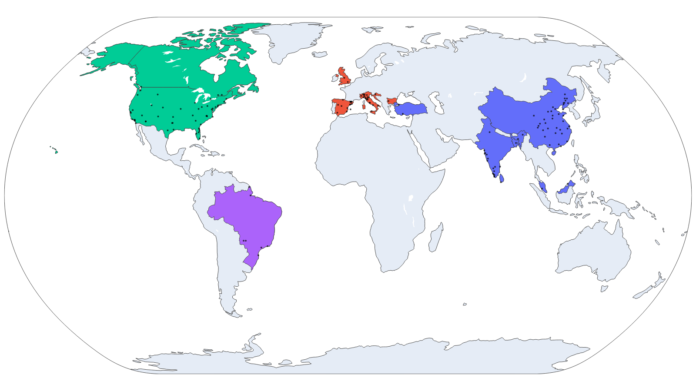

## Overview

## Usage of the code
The code is open-source and free to use. It is aimed for, but not limited to, academic research. We welcome forking of this repository, pull requests, and any contributions in the spirit of open science and open-source code 😍😄 For inquiries about collaboration, you may contact Pavlo Bazilinskyy (pavlo.bazilinskyy@gmail.com) or Md Shadab Alam (md_shadab_alam@outlook.com).

## Getting Started
Tested with Python 3.9.19. To setup the environment run these two commands in a parent folder of the downloaded repository (replace `/` with `\` and possibly add `--user` if on Windows:

**Step 1:**

Clone the repository
```command line
git clone https://github.com/bazilinskyy/youtube-replication
```

**Step 2:**

Create a new virtual environment
```command line
python -m venv venv
```

**Step 3:**

Activate the virtual environment
```command line
source venv/bin/activate
```

On Windows use
```command line
venv\Scripts\activate
```

**Step 4:**

Install dependencies
```command line
pip install -r requirements.txt
```

**Step 5:**

Ensure you have the required datasets in the data/ directory, including the mapping.csv file.

**Step 6:**

Run the code:
```command line
python3 analysis.py
```

## Description and analysis of dataset
### Description of dataset
[](https://htmlpreview.github.io/?https://github.com/bazilinskyy/youtube-national/blob/main/figures/map.html)
The 133 countries with dashcam footage included in analysis on the political map (coloured by continent). Black dots show the cities included.

## License
This project is licensed under the MIT License - see the LICENSE file for details.

## Contact
If you have any questions or suggestions, feel free to reach out to pavlo.bazilinskyy@gmail.com.
