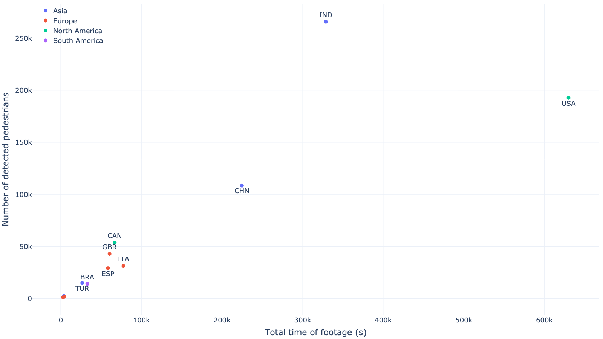
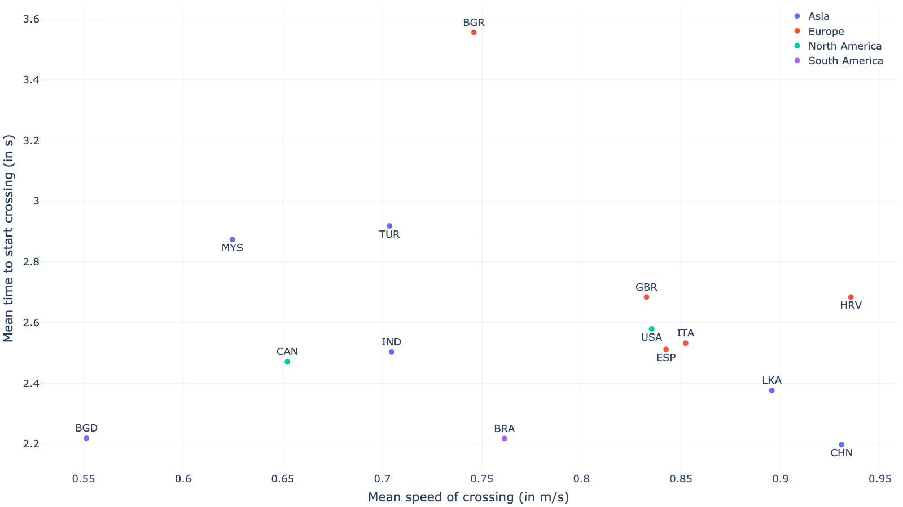
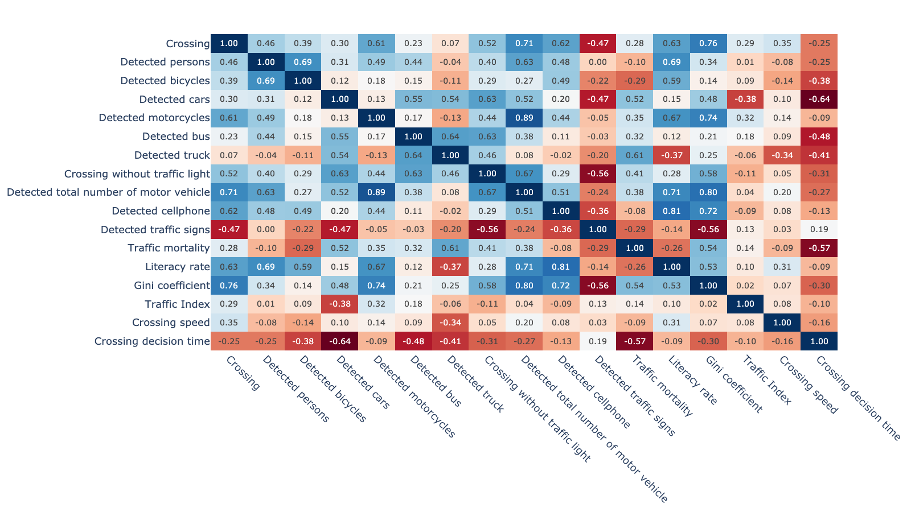
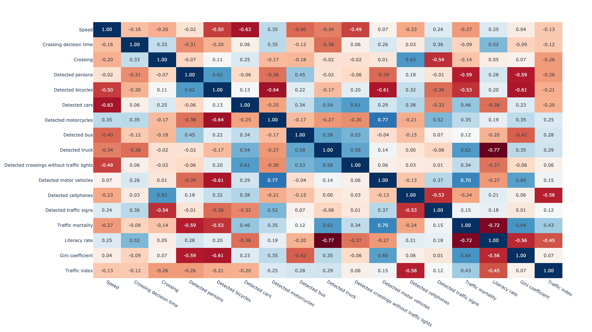
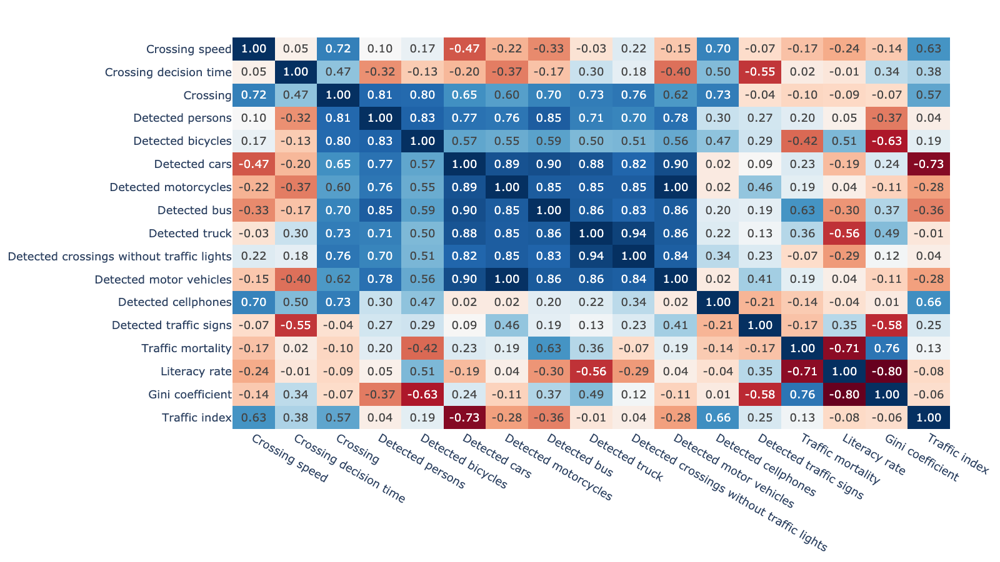

## Overview

## Usage of the code
The code is open-source and free to use. It is aimed for, but not limited to, academic research. We welcome forking of this repository, pull requests, and any contributions in the spirit of open science and open-source code 😍😄 For inquiries about collaboration, you may contact Pavlo Bazilinskyy (pavlo.bazilinskyy@gmail.com) or Md Shadab Alam (md_shadab_alam@outlook.com).

## Getting Started
Tested with Python 3.9.19. To setup the environment run these two commands in a parent folder of the downloaded repository (replace `/` with `\` and possibly add `--user` if on Windows:

**Step 1:**

Clone the repository
```command line
git clone https://github.com/bazilinskyy/youtube-replication
```

**Step 2:**

Create a new virtual environment
```command line
python -m venv venv
```

**Step 3:**

Activate the virtual environment
```command line
source venv/bin/activate
```

On Windows use
```command line
venv\Scripts\activate
```

**Step 4:**

Install dependencies
```command line
pip install -r requirements.txt
```

**Step 5:**

Ensure you have the required datasets in the data/ directory, including the mapping.csv file.

**Step 6:**

Run the code:
```command line
python3 analysis.py
```

### Configuration of project
Configuration of the project needs to be defined in `config`. Please use the `default.config` file for the required structure of the file. If no custom config file is provided, `default.config` is used. The config file has the following parameters:
- **`data`**: Directory containing data (CSV output from YOLO).
- **`videos`**: Directories containing the videos used to generate the data.
- **`mapping`**: CSV file that contains mapping data for the cities referenced in the data.
- **`prediction_mode`**: Configures YOLO for object detection.
- **`tracking_mode`**: Configures YOLO for object tracking.
- **`always_analyse`**: Always conduct analysis even when pickle files are present (good for testing).
- **`display_frame_tracking`**: Displays the frame tracking during analysis.
- **`save_annotated_img`**: Saves the annotated frames produced by YOLO.
- **`delete_labels`**: Deletes label files from YOLO output.
- **`delete_frames`**: Deletes frames from YOLO output.
- **`delete_youtube_video`**: Deletes saved YouTube videos.
- **`compress_youtube_video`**: Compresses YouTube videos (using the H.255 codec by default).
- **`delete_runs_files`**: Deletes files containing YOLO output after analysis.
- **`monitor_temp`**: Monitors the temperature of the device running the analysis.
- **`check_missing_mapping`**: Identifies all the missing csv files.
- **`client`**: Specifies the client type for downloading YouTube videos; accepted values are `"WEB"`, `"ANDROID"` or `"ios"`.
- **`model`**: Specifies the YOLO model to use; supported/tested versions include `v8x` and `v11x`.
- **`countries_analyse`**: Lists the countries to be analysed.
- **`confidence`**: Sets the confidence threshold parameter for YOLO.
- **`update_ISO_code`**: Updates the ISO code of the country in the mapping file during analysis.
- **`update_pop_country`**: Updates the country’s population in the mapping file during analysis.
- **`update_continent`**: Updates the continent information in the mapping file during analysis.
- **`update_mortality_rate`**: Updates the mortality rate of the country in the mapping file during analysis.
- **`update_gini_value`**: Updates the GINI value of the country in the mapping file during analysis.
- **`update_upload_date`**: Updates the upload date of videos in the mapping file during analysis.
- **`update_fps_list`**: Updates the FPS (frames per second) information for videos in the mapping file during analysis.
- **`update_pytubefix`**: Updates the `pytubefix` library each time analysis starts.
- **`font_family`**: Specifies the font family to be used in outputs.
- **`font_size`**: Specifies the font size to be used in outputs.
- **`plotly_template`**: Defines the template for Plotly figures.
- **`logger_level`**: Level of console output. Can be: debug, info, warning, error.
- **`sleep_sec`**: Amount of seconds of pause between going over the mapping files.

## Description and analysis of dataset
### Description of dataset
[](https://htmlpreview.github.io/?https://github.com/bazilinskyy/youtube-replication/blob/main/figures/map.html)
The 11 countries with dashcam footage included in analysis on the political map (coloured by continent). Black dots show the cities included.

[](https://htmlpreview.github.io/?https://github.com/bazilinskyy/youtube-replication/blob/main/figures/scatter_total_time-person.html)
Total time of footage over number of detected pedestrians.

### Relationship between computed and statistical metrics
[](https://htmlpreview.github.io/?https://github.com/bazilinskyy/youtube-replication/blob/main/figures/scatter_speed_crossing_avg-time_crossing_avg.html)
Mean speed of crossing (in m/s) over Mean time to start crossing (in s) (in s).

### Correlation matrices
[](https://htmlpreview.github.io/?https://github.com/bazilinskyy/youtube-replication/blob/main/figures/correlation_matrix_heatmap_averaged.html)
Correlation matrix.

[](https://htmlpreview.github.io/?https://github.com/bazilinskyy/youtube-national/blob/main/figures/correlation_matrix_heatmap_day.html)
Correlation matrix at daytime.

[](https://htmlpreview.github.io/?https://github.com/bazilinskyy/youtube-national/blob/main/figures/correlation_matrix_heatmap_night.html)
Correlation matrix at night time.

## License
This project is licensed under the MIT License - see the LICENSE file for details.

## Contact
If you have any questions or suggestions, feel free to reach out to pavlo.bazilinskyy@gmail.com.
